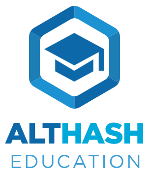

# IDVAULT
## REDUCE VOTER FRAUD INEFFICIENCIES WITH VERIFIABLE AUDIT TRAILS

by 
	
    Amari Esmel Phillipe Arnaud
	Elizabeth Yetunde Abraham
	Gaius Paul Ekanem
    Monique Finley
	Odu, Stephen Anyaku III
	
    
COHORT 18/3: CAPSTONE GROUP 4

CÔTE D'IVOIRE | NIGERIA | LOUISIANA, USA

A CAPSTONE PROJECT 
SUBMITTED TO THE FACULTY OF BLOCKCHAIN STUDIES AND ARTIFICIAL 
INTELLIGENCES AT THE ALTHASH UNIVERSITY 
IN PARTIAL FULFILLMENT OF THE REQUIREMENTS FOR 
THE COLLEGIATE OF SCIENCE IN BLOCKCHAIN STUDIES 

CHICAGO, IL.

(C)2023 MONIQUE FINLEY [Replace with your name on your paper]

## TABLE OF CONTENTS

[X] COVER PAGE 
[X] TABLE OF CONTENTS 
[X] ABSTRACT 
[X] CAPSTONE DEFENSE APPROVAL FORM (blanks in your TEAM folder) 
[X] WAIVER REQUEST FORM (blanks in your TEAM folder) 
[X] INTRODUCTION 
[X] PROBLEM STATEMENT 
[X] SOLUTION STATEMENT 
[X] PLATFORM 
[XX] PROJECT BUDGET & BUDGET ALLOCATIONS 
[X] PROJECT LAUNCH DATE 
[XXX] GITHUB ACCOUNT (replace with your link) 
[X] COURSES TAKEN 
[X] LADDERDIZED CERTIFICATES & DIPLOMAS (replace with your link) 
[X] TRANSCRIPTS OF ACADEMIC RECORDS (replace with your link) 
[X] BCE 501 SERIES BLOCKCHAIN CONTINUING EDUCATION (replace with your link) 
- [] PROFESSIONAL ORGANIZATION 
- [] RESUME 
[X] BLOCKCHAIN OATH OF PROFESSION (replace with your oath) 

## ABSTRACT 

This capstone research proposal explores the use of blockchain technology as a solution to
mitigate electoral fraud and inefficiencies in the electoral process. Blockchain offers an
innovative perspective by providing verifiable audit trails, enabling immediate and
independent verification of electoral records. The fundamental features of blockchain, such as
decentralization and immutability, have the potential to radically transform traditional
electoral auditing practices. This research will analyze in detail the advantages and
disadvantages of adopting blockchain for electoral audits, highlighting elements such as
transparency, immutability, and distributed consensus. Exploring smart contracts and digital
signatures will be at the core of our study, aiming to strengthen audit procedures and ensure
the reliability of electoral records. This study will combine qualitative and quantitative
research approaches, including literature analysis, case studies, and interviews with domain
experts. The ultimate goal of this research is to provide a comprehensive understanding of
how blockchain integration can enhance the efficiency of the electoral process and the
accuracy of results, thereby contributing to trust in the integrity of elections. 

### Keywords: 
Electoral Fraud, Electoral Inefficiencies, Audit, Blockchain Technology, Record
Verification, Verifiable Audit Trails, Transparency, Immutable, Smart Contracts, Digital
Signatures.

## CAPSTONE DEFENSE APPROVAL FORM
[Capstone Defense Approval Form](/TEAM/Finley/Defense_Forms/)
Replace with your name and link.

## WAIVER REQUEST FORM
[Waiver Request Form](/TEAM/Finley/Defense_Forms/)
Replace with your name and link.

## INTRODUCTION

Electoral fraud and inefficiencies in the electoral process pose significant challenges to
modern democracy. In an increasingly digitized world, it is imperative to find innovative and
reliable ways to ensure the integrity and transparency of elections. It is in this context that our
synthesis project, titled "Reduce Voter Fraud Inefficiencies with Verifiable Audit Trails," takes shape.

Blockchain technology has already proven its effectiveness in various fields, including secure
and transparent management of financial transactions. In a traditional electoral process,
inefficiencies and fraud risks persist because auditors often rely on third parties to verify the
accuracy of records. This approach can be costly, prone to human errors, and potentially
subject to manipulation.

Blockchain offers a revolutionary alternative. It allows direct verification of records from
their creation, eliminating the need for third parties and significantly reducing the risk of
human error or fraud. Furthermore, it offers the possibility of instant verification, enabling the
identification and prevention of electoral fraud faster than ever before.

In this project, we will explore how blockchain technology can be implemented to ensure fair,
transparent, and efficient elections. We will examine the advantages of blockchain for
electoral processes and identify the challenges that must be overcome to fully leverage its
potential.

We firmly believe that this synthesis project can make a significant contribution to democracy
by strengthening citizens' trust in the electoral process. By providing a comprehensive
overview of blockchain's potential for electoral auditing, we hope to assist key stakeholders,
including electoral authorities and citizens, in understanding the benefits of this technology
and developing strategies to ensure fair and verifiable elections.

## PROBLEM STATEMENT

Our synthesis project, titled "Reduce Voter Fraud and Inefficiencies Through Verifiable
Audit Trails," stems from the observation that current electoral processes are susceptible to
fraud and inefficiencies due to insufficient trust in existing verification systems. Electoral
fraud and inefficiencies in the electoral process undermine citizens' confidence in the
democratic system. These issues can lead to non-representative outcomes and widespread
mistrust, threatening the stability of governments and the legitimacy of elections. It is
imperative to ensure the integrity and efficiency of the electoral process to maintain
democracy.

Stakeholders affected by this issue include voters, electoral bodies responsible for organizing
elections, political parties participating in polls, as well as electoral observers and civil society
monitoring elections. All these stakeholders have a direct interest in ensuring that elections
are fair, transparent, and efficient. While seeking to address this problem, it is essential to
ensure that the proposed solutions do not introduce new barriers to electoral participation and
guarantee equal opportunities for all voters. The principles of transparency, fairness, and trust
in the electoral process must be upheld.

Our project aims to explore and propose solutions based on verifiable audit trails to reduce
electoral fraud and inefficiencies. This could include the use of technologies such as
blockchain to secure and make transparent the electoral process, the implementation of
mechanisms for vote verifiability, voter education on these new technologies, and the
involvement of independent organizations in auditing the electoral process. These approaches
will help build trust in elections and ensure fairer and more representative results.

## SOLUTION STATEMENT

To address the problem of electoral fraud and inefficiencies in the electoral process, our
solution will rely on verifiable audit trails, building upon the approach proposed in the project
titled "Reduce Voter Fraud Inefficiencies with Verifiable Audit Trails." This will ensure a more
transparent, efficient, and secure electoral process.

We propose adopting blockchain technology to secure and make transparent the electoral
process, just as it is used for financial and non-financial records in the previous project.
Blockchain will ensure the integrity of electoral data by recording each vote in an immutable
and transparent manner. We will also explore the use of smart contracts and digital signatures to strengthen the audit
procedure.

The ultimate goal of our research is to provide a comprehensive understanding of how
blockchain can transform the electoral process, increase efficiency, accuracy, and trust in
electoral records keeping. This approach will contribute to the advancement of electoral
auditing practices, thus strengthening democracy by reducing electoral fraud and improving
the efficiency of elections.

## VISION, MISSION, GOALS, AND OBJECTIVES
### Vision
"Our vision is to become a key player in combating electoral fraud and inefficiencies by
introducing verifiable audit trails to enhance trust and integrity in electoral processes on a
national and international scale. We aspire to a future where every citizen can be certain that
their vote counts, and elections are fair, transparent, and representative. By adopting
innovative solutions, including blockchain technology, we aim to promote democracy by
ensuring reliable and equitable elections."

### Mission
"Our mission is to use blockchain technology to revolutionize how elections are conducted.
We aim to provide a transparent and secure platform where electoral processes are recorded in
an immutable and verifiable manner, ensuring trust and integrity in the democratic process.
Capitalizing on the immutability and transparency of blockchain, we empower citizens with
independent electoral participation and inviolable auditing. Our goal is to strengthen
democracy by ensuring fair, transparent, and representative elections for all."

### Goals
- Streamline electoral processes to ensure fair and transparent elections.
- Enhance the integrity of electoral data and bolster citizens' trust in the democratic
system.
- Promote efficiency and cost savings in organizing elections.
- Promote global accessibility to verifiable and equitable electoral procedures.
- Collaborate with electoral industry stakeholders to implement verifiable audit trails
and improve democracy.

### Objectives
- Develop a robust and secure infrastructure for electoral auditing based on blockchain
technology.
- Implement smart contract automation to ensure the integrity of electoral processes.
- Provide user-friendly interfaces for voters and electoral authorities, making audit trails
accessible to all.
- Establish partnerships and integration with key electoral industry players to ensure the
successful implementation of verifiable audit trails.
- Conduct ongoing research and development to refine verifiable audit trail-based solutions and adapt them to the changing needs of electoral processes
- Educate and raise awareness among voters about the importance of electoral verification and new technologies to promote informed and active participation in the democratic process 

## PLATFORM
### Platform Name: IDVault

The name "IDVault" for the platform was chosen considering several essential reasons.
Security and Privacy: The use of the word "Vault" in the name immediately conveys a sense
of security and data protection. This aligns perfectly with the goal of our project to ensure the
integrity of electoral data and reduce fraud. 

Identification: The prefix "ID" suggests identification, which is crucial in the electoral
context.  It indicates that the "IDVault" platform is dedicated to the secure management of 
electoral identifications. 

The name also implies the ability to store verified and audited records transparently, which is essential
for ensuring the integrity of electoral processes. Lastly, "IDVault" is short, simple, and
memorable, which will facilitate its adoption by voters, electoral authorities, and other
stakeholders.

The name of the token, "IDVault Token," is a natural extension of the platform's name. It
provides an identity to the token used within our platform system. Here's why this token name
is appropriate:

Continuity: The inclusion of the word "Token" after "IDVault" clearly indicates that it is the
digital currency associated with the platform. This creates logical continuity.

Trust and Verification: "Vault" suggests security, while "Token" evokes the concept of trust
in a digital system. Together, "IDVault Token" suggests a trustworthy digital currency that
can be used to verify and audit electoral records. Just like the platform's name, "IDVault
Token" is easy to understand for users and stakeholders.

In summary, the platform name "IDVault" and the token name "IDVault Token" are wise
choices for our synthesis project. They embody security, trust, and verification, which are
essential elements in achieving our project's goals related to reducing electoral fraud and
improving the efficiency of electoral processes.

### Platform Blockchain – Overview

IDVault, as a Layer 2 platform powered by the IDVault Token, our users would experience significantly lowered transaction fees reducing government election costs, election officials would access programmable features via smart contracts enabling the standardization and templating of election ballot designs, and be independently verifiable by any voter that wanted to verify their own vote. While running on a Layer 1 platform like Althash, we see the increased transparency available in publically maintained blockchains, can secure election results to a public chain, and enable publically auditable and immutable records. We also keep the ability for independent verifiers to run their own blockchain nodes.

To initiate the voting process, the voter registers to vote with a governing body. Registering authorities require trustworthy methods for guaranteeing the person who shows up is allowed to be a participating voter. The governing authorities need to be able to support the voters' user requests. The support channels need methods to help registered users recover lost accounts, prevent account theft, and deal with identity theft attempts. Voters using the platform to make their votes will want a method of ensuring that their vote went to their choice and not to some other option. Essentially, this is an ID account used for voting as such it would have long term implications for security, maintenance, and education.

#### Political Registrations Example (MVP)
1. Full Name (First and Last Name / Business Name DBA)
2. Government ID (Social Security Number / TIN)
3. Address (Physical Address for political zoning)
4. Voting Party (If registered)

Rules for voter registration vary across the globe, many have a minimum identification requirement. Any blockchain ID solution should meet these minimum requirements, while also allowing election authorities to design elections based on the rules of their districts. Voters must be able to easily use the system by experiencing little to no transition difficulties. The voter wants to keep their identity safe, to know that their vote is correctly cast, and to keep their identity anonymous.

Choosing Althash and HTMLCoin as the layer 1 blockchain platform for our project is a strategic decision driven by their unique strengths. Althash offers a robust and secure blockchain infrastructure that is well-suited for the intricate requirements of digital identity and voting systems. Its commitment to decentralized solutions and innovative consensus mechanisms aligns seamlessly with our vision for transparent and tamper-resistant audit trails. HTMLCoin, known for its versatility and user-friendly development environment, complements Althash by providing a flexible platform for the implementation of smart contracts and decentralized applications. Together, this dual-layer approach leverages the strengths of both Althash and HTMLCoin, ensuring a resilient and scalable foundation for our project. The synergy between these platforms not only enhances the security and reliability of our digital identity and voting systems but also fosters an environment conducive to continuous innovation in the evolving landscape of blockchain technology.

## PROJECT BUDGET & BUDGET ALLOCATIONS
### Proposed Budget #1
The budget figures for a Blockchain project are justifiable based on the following
considerations:

    Project Development
    This cost covers the following (all figures in USD):
        UI/UX Design : 5 000,00 $
        Smart Contract Development : 20 000,00 $
        Front-end Development : 10 000,00 $
        Back-end Development : 10 000,00 $
        Integration and testing : 5 000,00 $
        *Total Development Costs : 50,000*

    Infrastructure Costs
    This cost covers the following (all figures in USD):
        Cloud Hosting (AWS) : 10 000,00 $
        Server Maintenance and Security : 5 000,00 $
        Domain Registration and SSL Certificate : 100,00 $
        *Total infrastructure Costs : 15,100*

    Maintenance and Upgrades
    This cost covers the following (all figures in USD):
        Bug Fixes and Updates : 5 000,00 $
        System Upgrades and Enhancements : 10 000,00 $
        *Total Maintenance and Upgrades : 15,000*

    Operational Costs
    This cost covers the following (all figures in USD):
        Employee Salaries (8 staff) : 40 000,00 $
        Marketing and Promotion : 18 000,00 $
        Legal and Compliance : 5 000,00 $
        Miscellaneous Expenses : 6 900,00 $
        *Total Operational Costs : 69,900*

    Others Costs
        Contingency Fund (10% of total costs and in USD) : 15,000
    
    30.31% 	    $50,000 	Project Development
    9.15% 		$15,100 	Infrastructure Costs
    9.09% 		$15,000 	Maintenance and Upgrades
    42.36% 	    $69,900 	Operational Costs
    9.09% 		$15,000 	Other Costs
                *$165,000*

This budget is based on a balanced allocation of resources for development, infrastructure,
maintenance, operations, and other necessary costs to ensure the success of our project.

### Proposed Budget #2
For a minimum viable product (MVP) launch, it's crucial to streamline the budget while ensuring essential 
infrastructure is covered. This budget 

    Salaries:
        Blockchain Developer (x2): $50,000 each
        Project Manager: $45,000
        UI/UX Designer: $40,000
        Quality Assurance (QA) Engineer: $35,000
        Marketing Specialist: $40,000

    Total Minimal Salaries: $210,000

    Essential Infrastructure and Technology:
        Cloud Services (AWS, Azure, etc.): $10,000
        Blockchain Platform Costs (Althash, HTMLCoin): $8,000
        Development Tools and Software Licenses: $5,000

    Total Minimal Infrastructure and Technology: $23,000

    Basic Operational Expenses:
        Co-Working or Remote Work Facilities: $10,000
        Utilities and Internet: $2,000
        Essential Office Supplies: $1,500

    Total Basic Operational Expenses: $13,500

    Launch Marketing:
        Basic Website Development and Maintenance: $5,000
        Initial Marketing Collaterals: $7,500

    Total Launch Marketing: $12,500

    Initial Training and Professional Development:
        Basic Training Programs: $5,000

    Total Initial Training: $5,000

    Contingency Fund:
        Unforeseen Expenses: $10,000

    Total Minimal Project Budget (excluding token pay): $274,000

This budget focuses on the core elements necessary for launching an MVP, ensuring that key roles are adequately compensated, essential infrastructure is in place, basic operational needs are met, and a modest marketing effort is executed. This budget allows for a lean and efficient MVP launch while maintaining financial prudence. Adjustments can be made based on specific circumstances and priorities.

NOTE: Our two budgets have a range of $165,000 to $274,000. The main difference appears in the number of staff and the amount of compensation they receive. 

## PROJECT LAUNCH DATE: 

The launch date for the project "Reduce Electoral Fraud and Inefficiencies Through
Verifiable Audit Trails" and its "IDVault" platform could be in July 2024, taking into account
the necessary planning and development.

The development of a Minimum Viable Product (MVP) is expected to take approximately 5
months, starting from July 2024. Testing, validation, and gathering feedback on the MVP
should take about 1 month, bringing the date to December 2024. Afterward, the team will
work on developing a scalable and modular platform to meet the specific needs of
stakeholders.

Launching the project in July 2024 will allow sufficient time for marketing and awareness
activities, ensuring that the project reaches its target audience and achieves its objectives.

## GITHUB ACCOUNT

[Monique Finley on GitHub](https://github.com/finleyexp/capstone-g2-2023)
Replace with your name and link.

### COURSES TAKEN

BLKN 205 Blockchain Theory & Practice; BLKN 300 Blockchain Technology & Innovation; CRPT 200 Introduction to Cryptocurrency+; BLKN 215 Applied Cryptography: Private & Public Keys and Digital Signature; BLKN 216 Cryptography and Hash Functions; CRPT 305 Currencies, Tokens, and Stable Coins; BLKN 320 Consensus Mechanisms; BLKN 340 Diversity and Inclusion in the Technology Industry; BLKN 334 Wallet Safety and Security; BLKN 232 Interoperability; BLKN Scalability and Other Challenges; BLKN 420 Decentralized Model and Consensus Mining; BLKN 344/DAPP 312 Enterprise Blockchain; 218 Blockchain Anatomy, Nodes, & Networks; BLKN 194 Independent Research in Blockchain Technology; CRPT 312 Tokenomics: Usage, Utility & Value, BLKN/PROG 346 Repository Systems; BLKN/PROG 350 Althash Blockchain; BLKN/PROG 348 Blockchain Architecture; PROG 100 Introduction to Smart Contracts; HEAL 308 Self-Care and Well-Being in the Digital Age; BLKN 480 Issues & Trends in Blockchain Technology; BLKN 490B Cryptographic Hash Functions; BLKN 490C Private & Public Keys and Digital Signatures; BLKN 342 Imposter Syndrome in Blockchain Technology; BLKN/PROG 352 Ethereum Blockchain; BLKN/COMD 310 Tribalism in Blockchain & Cryptocurrency; BLKN 495 Blockchain Profession; BLKN 311/DAPP 311 Blockchain-enabled Electronic Health Records; TKNS 330 NFT Development; BLKN 356 Self-Sovereign Identity; BLKN 354 Blockchain Leadership & Management; PROG 358 Introduction to Hyperledger Fabric; BLKN 596 Blockchain Career Development; BLKN 492 Directed Research in Blockchain Studies;BLKN 499 Capstone Defense

## LADDERDIZED CERTIFICATES & DIPLOMAS

[Monique Finley's Certificates & Diplomas](TEAM/Finley/Certificates)
Replace with your name and link.

## TRANSCRIPTS OF ACADEMIC RECORDS

[Monique Finley's Certificates & Diplomas](TEAM/Finley/Transcripts)
Replace with your name and link.

## BCE 501 SERIES Essays BLOCKCHAIN CONTINUING EDUCATION

[Monique Finley's 501 Series Essays](TEAM/Finley/501_Series_Essays)
Replace with your name and link.

## PROFESSIONAL ORGANIZATION

ICORBP: International Council of Registered Blockchain Professionals

Your certificate goes here - TBA.

## RESUME

[Monique Finley's Resume](TEAM/Finley/Resume)
Replace with your name and link.

## BLOCKCHAIN OATH OF PROFESSION

In the realm of blockchain, I pledge to champion integrity, transparency, and security. My commitment is to conduct myself with unwavering honesty, prioritize open-source development, and ensure the robust security of blockchain networks. Embracing innovation and continuous learning, I aim to contribute to the evolution of blockchain technology. Inclusivity guides my actions as I strive to create a diverse and accessible blockchain community. With a focus on social responsibility, I consider the broader impact of blockchain applications and actively seek collaboration to foster a shared vision within the blockchain ecosystem.

*Replace with your pledge.*

